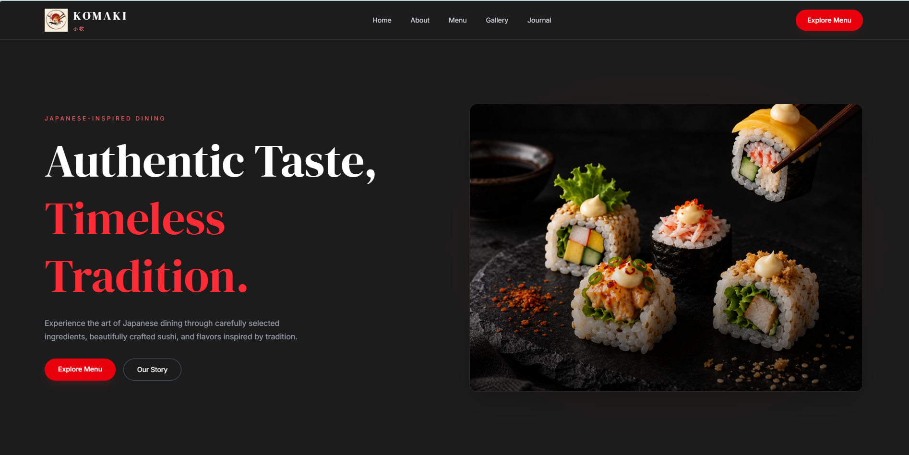
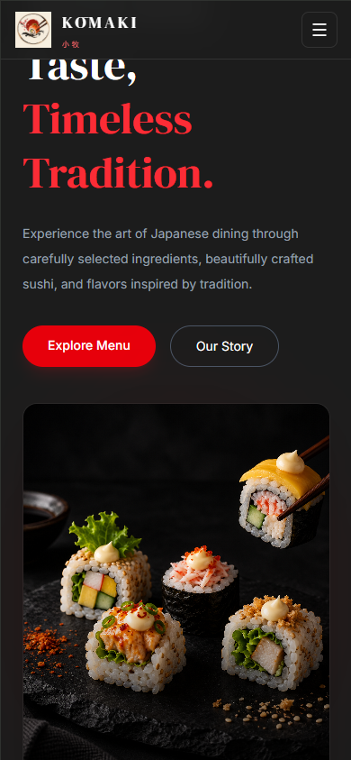
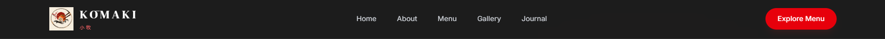
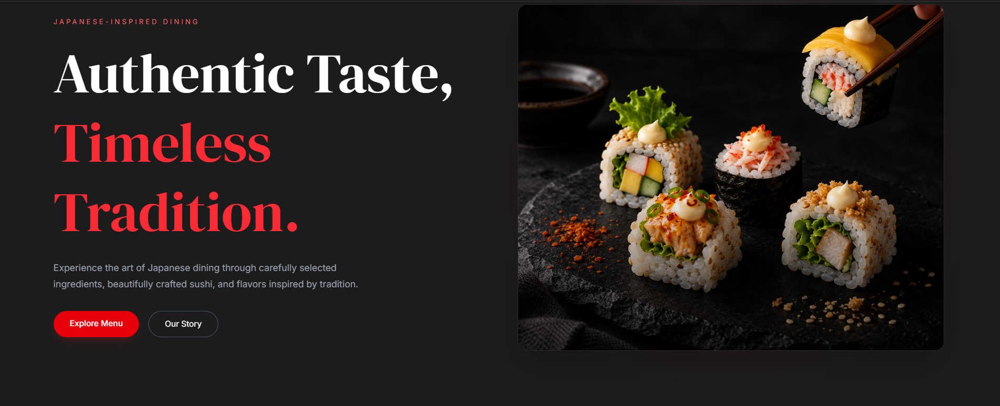
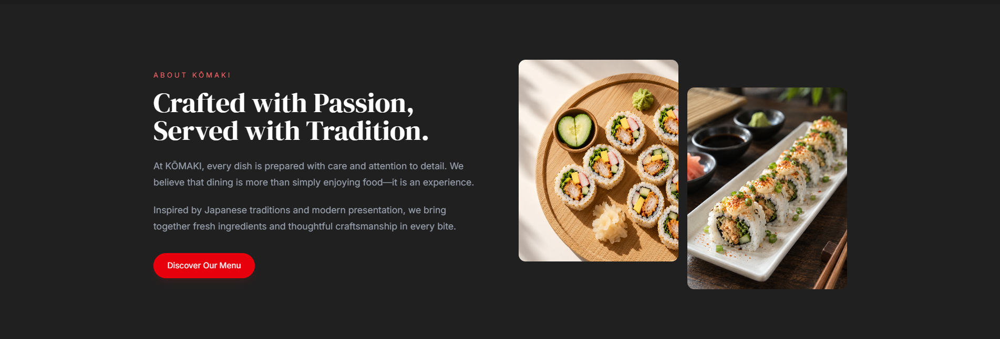
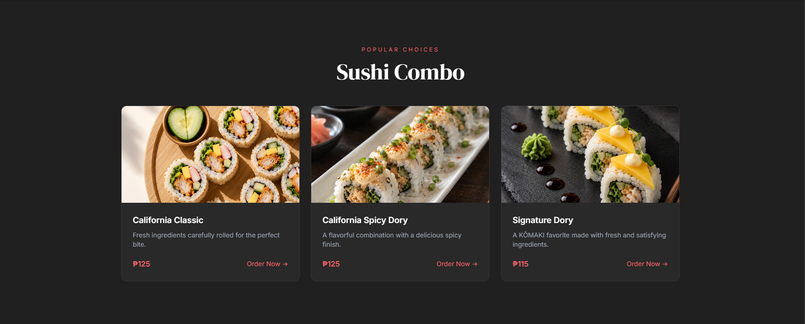
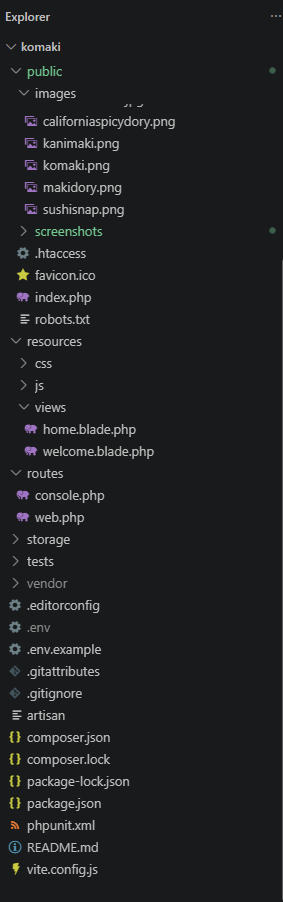
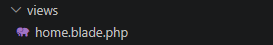
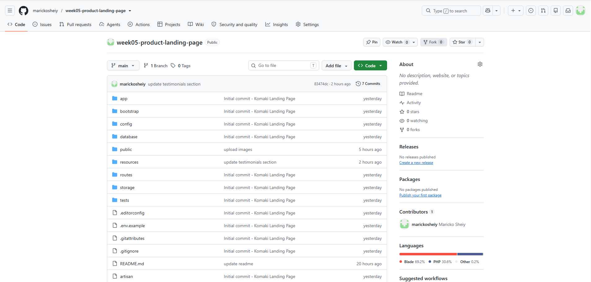

# KŌMAKI — Japanese-Inspired Dining Landing Page

## Introduction

### What is a Product Landing Page?

A product landing page is a dedicated web page designed to introduce and promote a product, service, brand, or business. It presents important information in a visually organized way and guides visitors toward specific actions, such as exploring a menu, viewing products, subscribing, or contacting the business.

### Why are Landing Pages Important for Businesses?

Landing pages are important because they provide visitors with a clear and focused introduction to a business. A well-designed landing page can:

- Create a strong first impression.
- Clearly communicate the brand identity.
- Highlight products, services, or features.
- Improve user engagement.
- Guide users toward important actions.
- Provide a responsive and accessible experience across different devices.

For a restaurant or dining business, a landing page can help communicate the atmosphere, menu offerings, brand story, and dining experience before customers visit.

### Purpose of the Project

The purpose of this project is to design and develop a modern, responsive product landing page for **KŌMAKI**, a Japanese-inspired dining concept.

The project focuses on creating a visually appealing interface that represents Japanese-inspired dining through elegant typography, a dark color palette, food imagery, and organized content sections.

The landing page was developed using:

- HTML
- Laravel Blade
- Tailwind CSS
- Responsive Web Design principles
- Flexbox
- CSS Grid
- Git and GitHub

The project includes multiple sections such as navigation, a hero section, features, gallery, testimonials, subscription content, and a footer.

---

# Objectives

The following learning objectives were accomplished during this activity:

- Create a complete product landing page.
- Apply responsive web design principles.
- Practice mobile-first web development.
- Use Tailwind CSS utility classes.
- Implement responsive breakpoints.
- Use Flexbox and CSS Grid for layouts.
- Create organized and reusable Blade templates.
- Improve user interface and user experience design.
- Maintain consistent typography and spacing.
- Use Git for version control.
- Create meaningful Git commits.
- Publish the project to a public GitHub repository.
- Document the development process using a README file.

---

# Responsive Web Design

Responsive web design allows a website to adapt to different screen sizes and devices. The KŌMAKI landing page was designed to provide a consistent and usable experience on desktop computers, tablets, and mobile phones.

## Mobile-First Design

Mobile-first design starts by designing the interface for smaller screens before adding styles for larger devices.

This approach helps ensure that:

- Content remains readable on mobile devices.
- Navigation remains usable.
- Images fit properly within smaller screens.
- Buttons are easy to tap.
- Sections do not overflow horizontally.

The layout adjusts as the screen becomes larger through responsive Tailwind CSS utility classes.

Example:

```html
<div class="grid grid-cols-1 gap-8 md:grid-cols-2 lg:grid-cols-3">
````

In this example:

* `grid-cols-1` displays one column on mobile devices.
* `md:grid-cols-2` displays two columns on medium-sized screens.
* `lg:grid-cols-3` displays three columns on large screens.

---

## Responsive Breakpoints

Responsive breakpoints allow the layout to change depending on the width of the device.

The project uses Tailwind CSS breakpoints such as:

* Default — Mobile
* `sm:` — Small screens
* `md:` — Medium screens or tablets
* `lg:` — Large screens or desktops

Example:

```html
<h2 class="text-4xl sm:text-5xl lg:text-6xl">
    What Our Guests Say
</h2>
```

The heading changes size depending on the screen size, helping maintain readability and visual hierarchy.

---

## Flexbox

Flexbox was used to arrange elements in rows and columns.

It was useful for:

* Navigation links.
* Buttons.
* Author information.
* Testimonial content.
* Footer content.

Example:

```html
<div class="flex items-center gap-4">
```

This allows items to align horizontally while maintaining consistent spacing.

---

## CSS Grid

CSS Grid was used for sections that require multiple columns.

For example, testimonial cards can be displayed using a responsive grid:

```html
<div class="grid grid-cols-1 gap-8 md:grid-cols-2 lg:grid-cols-3">
```

The layout automatically changes from one column on mobile devices to multiple columns on larger screens.

---

## User Experience (UX)

Responsive design improves user experience by ensuring that visitors can comfortably use the website regardless of their device.

Important UX considerations in this project include:

* Readable text sizes.
* Clear navigation.
* Consistent spacing.
* Responsive images.
* Visible buttons.
* Proper content hierarchy.
* Organized sections.
* Mobile-friendly layouts.

Responsive design is important in modern web applications because users access websites from many different devices. A website that only works properly on a desktop computer may provide a poor experience for mobile and tablet users.

---

# Tailwind CSS

Tailwind CSS was used to style and build the KŌMAKI landing page.

## Utility-First CSS

Tailwind CSS uses utility classes to apply styling directly within HTML or Blade elements.

Instead of creating a separate CSS class for every design element, utility classes can be combined.

Example:

```html
<div class="rounded-2xl border border-white/10 bg-[#242424] p-8">
```

This applies:

* Rounded corners.
* A border.
* A custom background color.
* Padding.

---

## Advantages of Tailwind CSS

Tailwind CSS provides several advantages:

* Faster development.
* Responsive utilities.
* Consistent spacing.
* Easy customization.
* Reduced need for large CSS files.
* Flexible component styling.
* Consistent design system.

It allows the interface to be adjusted directly within the Blade templates.

---

## Responsive Utility Classes

Tailwind makes responsive design easier by allowing breakpoint prefixes.

Example:

```html
<div class="px-6 sm:px-10 lg:px-20">
```

This means:

* Mobile devices use `px-6`.
* Small screens use `sm:px-10`.
* Large screens use `lg:px-20`.

Another example:

```html
<div class="grid grid-cols-1 md:grid-cols-2 lg:grid-cols-3">
```

The layout changes automatically depending on the screen size.

---

## Component Styling

Tailwind CSS was used to style different components and sections of the landing page, including:

* Navigation bar.
* Hero section.
* Buttons.
* Feature cards.
* Gallery.
* Testimonials.
* Subscription section.
* Footer.

Example of a testimonial card:

```html
<div class="rounded-2xl border border-white/10 bg-[#242424] p-8">
    <p class="mb-6 text-lg tracking-widest text-red-400">
        ★★★★★
    </p>

    <p class="mb-8 leading-7 text-gray-300">
        “The atmosphere was elegant and relaxing, and every dish
        was beautifully prepared.”
    </p>
</div>
```

---

# Blade Components

## What are Blade Components?

Blade is Laravel's templating engine. It allows developers to create dynamic and reusable templates for web applications.

Blade components can be used to separate repeated user interface elements into reusable files.

Examples of reusable interface elements include:

* Navigation bars.
* Buttons.
* Cards.
* Headers.
* Footers.
* Testimonials.

Instead of repeating the same HTML code throughout multiple pages, a reusable component can be created and used wherever it is needed.

---

## Why Reusable Components Improve Maintainability

Reusable components improve maintainability because changes can be made in one location.

For example, if a navigation bar is used on multiple pages, updating the navigation component automatically updates every page that uses it.

This helps:

* Reduce duplicate code.
* Keep the design consistent.
* Make updates easier.
* Improve project organization.
* Reduce development time.

---

## Benefits of Modular UI Development

Modular user interface development divides a website into smaller and manageable parts.

Benefits include:

* Better code organization.
* Easier maintenance.
* Reusable interface elements.
* Faster development.
* Consistent styling.
* Easier debugging.


A Blade layout can contain common page elements while individual pages contain specific content.

Example:

```php
@extends('layouts.app')

@section('content')

    <section class="hero-section">
        <h1>Authentic Taste, Timeless Tradition.</h1>
    </section>

@endsection
```

---

# User Interface Design

The KŌMAKI landing page follows a modern Japanese-inspired visual style.

## Color Palette

The interface primarily uses a dark color palette with red accent colors.

Main colors include:

* Dark background tones.
* White and light gray text.
* Red accent colors.
* Neutral borders.

The dark background creates an elegant dining atmosphere, while the red accents provide contrast and visual emphasis.

---

## Typography

Typography plays an important role in establishing the identity of KŌMAKI.

The design uses contrasting typography styles:

* Serif-style display typography for major headings.
* Clean sans-serif typography for body text and navigation.

Large headings create strong visual hierarchy while smaller text remains readable.

Example:

```html
<h2 class="text-4xl leading-tight text-white sm:text-5xl lg:text-6xl">
    What Our Guests Say
</h2>
```

---

## Iconography

Icons and symbols are used carefully to support the interface without overwhelming the design.

Examples include:

* Navigation menu icons.
* Arrow indicators.
* Rating stars.
* Social media icons where applicable.

The iconography supports usability while maintaining the overall visual style.

---

## Button Styles

Buttons use clear contrast and rounded shapes to make important actions visible.

Primary buttons use a red accent color.

Example:

```html
<a href="#menu"
   class="rounded-full bg-red-500 px-6 py-3 font-semibold text-white">
    Explore Menu
</a>
```

Button styles remain consistent throughout the landing page.

---

## Card Design

Cards are used to organize content into visually separated sections.

The testimonial cards use:

* Dark backgrounds.
* Rounded corners.
* Subtle borders.
* Consistent padding.
* Clear typography.

Example:

```html
<div class="rounded-2xl border border-white/10 bg-[#242424] p-8">
```

This creates separation between content while maintaining consistency with the overall dark interface.

---

## Layout Consistency

Consistent spacing and alignment were used throughout the project.

The layout follows a consistent pattern of:

* Section headings.
* Content containers.
* Padding.
* Margins.
* Grid layouts.
* Responsive spacing.

This consistency helps users understand the structure of the website and improves the overall user experience.

---

# Folder Structure

The project uses an organized Laravel folder structure.

## resources/views/layouts

This folder contains reusable page layouts.

Layouts can include common page structures such as:

* HTML structure.
* Head elements.
* Navigation.
* Footer.
* Shared scripts and styles.

Example:

```text
resources/views/layouts/
```

---

## resources/views/components

This folder is intended for reusable Blade components.

Components may include:

* Navigation.
* Buttons.
* Cards.
* Hero sections.
* Testimonials.
* Footer components.

Example:

```text
resources/views/components/
```

Reusable components help reduce duplicate code and improve maintainability.

---

## resources/views/pages

This folder contains individual page content.

Example:

```text
resources/views/pages/
```

A page file contains the specific sections and content displayed to users.

---

## public

The `public` folder contains publicly accessible files.

Examples include:

* Images.
* Compiled assets.
* Icons.
* Favicon files.

Example:

```text
public/
├── build/
├── images/
├── favicon.ico
└── index.php
```

---

## screenshots

The `screenshots` folder contains images used to document the project.

Screenshots include:

* Desktop view.
* Tablet view.
* Mobile view.
* Navigation.
* Hero section.
* Features.
* Pricing cards.
* Testimonials.
* Footer.
* Project structure.
* GitHub repository.

Example:

```text
screenshots/
```

---

## documentation

The `documentation` folder contains documentation-related images and files.

This folder is also used for the before-and-after comparison.

Example:

```text
documentation/
├── before-design.png
└── after-design.png
```

---

# Before-and-After Comparison

The KŌMAKI interface evolved from an initial basic HTML structure into a polished responsive landing page.

## Before

The initial version focused primarily on the content structure.

The early prototype included:

* Basic HTML elements.
* Plain text.
* Basic navigation links.
* Images without final layout styling.
* Sections arranged without the final design system.

The purpose of the early version was to establish the structure and content of the landing page before applying the final visual design.

### Before Design


---

## After

The final version includes a more polished and visually organized interface.

Improvements include:

* Responsive layouts.
* Tailwind CSS styling.
* Improved typography.
* Dark Japanese-inspired color palette.
* Red accent colors.
* Responsive navigation.
* Improved spacing.
* Responsive grids.
* Styled testimonial cards.
* Improved visual hierarchy.
* Better usability across devices.

### After Design


---

# Screenshots

## Desktop View



---

## Tablet View


---

## Mobile View



---

## Navigation Bar



---

## Hero Section



---

## Features Section



---

## Pricing Cards



---

## Testimonials


---

## Footer


---

## VS Code Project Structure



---

## Blade Components Folder



---

## GitHub Repository



---

# Design Principles

The KŌMAKI landing page follows several modern design principles.

## Consistent Spacing and Typography

Consistent margins, padding, and typography create a cleaner and more organized interface.

## Limited and Harmonious Color Palette

The project uses a limited combination of dark tones, white text, gray elements, and red accents.

This creates a cohesive visual identity.

## Color Contrast and Accessibility

Light text is used against dark backgrounds to improve readability.

Red accent colors are used primarily for:

* Buttons.
* Labels.
* Ratings.
* Important actions.

This helps important elements stand out without overwhelming the interface.

## Original Design

The KŌMAKI landing page was designed specifically for this project.

The interface was inspired by modern restaurant and Japanese-inspired design principles while creating an original layout, structure, and visual identity.

---

# Technologies Used

* HTML
* CSS
* Tailwind CSS
* Laravel
* Blade Templates
* JavaScript
* Vite
* Git
* GitHub

---

# GitHub Repository

**Repository Name: https://github.com/marickosheiy/week05-product-landing-page.git**

```text
week05-product-landing-page
```

The repository is configured as a public repository and contains the complete source code and project documentation.

The project development includes meaningful Git commits documenting the progression of the landing page.


---

# Project Features

The KŌMAKI landing page includes:

* Responsive navigation.
* Mobile-friendly menu behavior.
* Japanese-inspired hero section.
* Responsive layouts.
* Food imagery.
* Feature and content sections.
* Gallery content.
* Journal section.
* Testimonials section.
* Subscription section.
* Footer.
* Tailwind CSS styling.
* Responsive breakpoints.
* Flexbox layouts.
* CSS Grid layouts.
* Laravel Blade templates.
* Git version control.

---

# Author

**Maricko Sheiy Villacorta**

Project: **KŌMAKI — Japanese-Inspired Dining Landing Page**

Week 05 — Product Landing Page Activity


# Screenshots

## Desktop View


---

## Tablet View


---

## Mobile View


---

## Navigation Bar


---

## Hero Section


---

## Features Section


---

## Pricing Section


---

## Testimonials


---

## Footer


---

## VS Code Project Structure


---

## Blade Components Folder


---

## GitHub Repository


