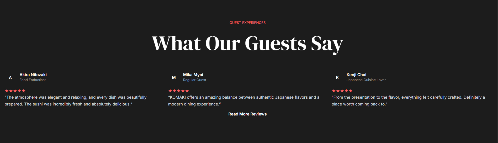
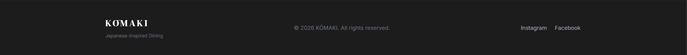

# KŌMAKI 🍣

## Week 05 – Responsive Product Landing Page

---

# 1. Project Title

# KŌMAKI – Japanese Dining Product Landing Page

KŌMAKI is a modern and responsive Japanese restaurant product landing page developed as part of the Week 05 Product Landing Page activity.

The website presents a Japanese-inspired restaurant experience through an elegant interface, food imagery, featured menu items, and interactive sections. The design focuses on creating a visually appealing and responsive experience across desktop, tablet, and mobile devices.

---

# 2. Introduction

## What is a Product Landing Page?

A product landing page is a dedicated web page designed to introduce and promote a specific product, service, business, or brand.

Landing pages are designed to immediately communicate important information to visitors. They usually contain a clear visual hierarchy, engaging images, descriptions, call-to-action buttons, and important business information.

For this project, the landing page introduces the fictional Japanese dining brand **KŌMAKI**.

## Why Are Landing Pages Important for Businesses?

Landing pages are important because they help businesses:

- Introduce their products or services clearly.
- Create a strong first impression.
- Communicate brand identity.
- Highlight important features or offerings.
- Encourage users to explore more content.
- Improve user engagement.
- Provide clear calls to action.

A well-designed landing page can help visitors quickly understand what a business offers and guide them toward the next action.

## Purpose of the Project

The purpose of this project is to apply modern web development and user interface design principles in creating a responsive product landing page.

The project focuses on:

- Responsive Web Design
- Tailwind CSS
- Laravel Blade templates
- User Interface Design
- Modern layout techniques
- Mobile-friendly navigation
- Visual hierarchy
- Responsive images and content

The goal is to create a polished landing page that provides a consistent experience across different devices.

---

# 3. Objectives

The following learning objectives were accomplished during this activity:

- Create a modern Product Landing Page.
- Apply Responsive Web Design principles.
- Use Tailwind CSS for styling.
- Use responsive utility classes.
- Implement Flexbox layouts.
- Implement CSS Grid layouts.
- Create responsive navigation.
- Improve user experience across different devices.
- Apply consistent typography and spacing.
- Use a limited and harmonious color palette.
- Create reusable and maintainable UI structures.
- Organize project files properly.
- Use Laravel Blade templates.
- Document the project using GitHub and README documentation.

---

# 4. Responsive Web Design

Responsive Web Design allows a website to adapt its layout and content according to the screen size of the device being used.

The KŌMAKI landing page was designed to provide a usable experience across:

- Desktop computers
- Laptops
- Tablets
- Mobile phones

## Mobile-First Design

Mobile-first design means designing for smaller screens first before adding enhancements for larger devices.

This approach is important because mobile devices have limited screen space. Content must remain readable, accessible, and easy to navigate.

Tailwind CSS makes this approach easier by allowing styles to be applied by default for mobile devices and modified for larger screens.

Example:

```html
<div class="flex flex-col md:flex-row">
```

On mobile devices, the content is displayed vertically.

On medium-sized screens and larger, the layout changes to a horizontal row.

---

## Responsive Breakpoints

Tailwind CSS provides responsive breakpoints that allow layouts to change depending on screen size.

Examples include:

```text
sm:
md:
lg:
xl:
```

Example:

```html
<h1 class="text-4xl md:text-6xl lg:text-7xl">
    Japanese Dining Experience
</h1>
```

This allows the heading to become larger on larger screens while remaining readable on smaller devices.

---

## Flexbox

Flexbox is used to arrange elements in rows or columns.

It is useful for:

- Navigation bars
- Hero content
- Buttons
- Logo alignment
- Content sections

Example:

```html
<div class="flex flex-col lg:flex-row">
```

On smaller screens, elements appear vertically.

On larger screens, elements are displayed horizontally.

---

## CSS Grid

CSS Grid is useful for displaying multiple items in an organized layout.

It is commonly used for:

- Menu items
- Food cards
- Gallery sections
- Content cards

Example:

```html
<div class="grid grid-cols-1 md:grid-cols-2 lg:grid-cols-3 gap-6">
```

The layout changes from:

- 1 column on mobile
- 2 columns on medium screens
- 3 columns on large screens

---

## User Experience (UX)

Responsive design improves User Experience because users can access the website comfortably regardless of the device they use.

Responsive design helps ensure:

- Text remains readable.
- Images remain visible.
- Navigation remains accessible.
- Buttons are easier to tap.
- Content does not overflow the screen.
- Layouts remain organized.

Responsive design is important in modern web applications because users access websites from many different screen sizes.

---

# 5. Tailwind CSS

## Utility-First CSS

Tailwind CSS uses a utility-first approach.

Instead of creating a large number of custom CSS classes, styles are applied directly using utility classes.

Example:

```html
<button class="bg-red-600 text-white px-6 py-3 rounded-full hover:bg-red-700 transition">
    Explore Menu
</button>
```

The classes control:

- Background color
- Text color
- Padding
- Border radius
- Hover effects
- Transitions

---

## Advantages of Tailwind CSS

Tailwind CSS provides several advantages:

- Faster UI development.
- Consistent spacing.
- Responsive utility classes.
- Easy customization.
- Reduced need for custom CSS.
- Consistent design system.
- Easy maintenance.

---

## Responsive Utility Classes

Tailwind uses breakpoint prefixes to modify layouts based on screen size.

Example:

```html
<div class="px-4 sm:px-6 md:px-10 lg:px-16 xl:px-24">
```

This allows the horizontal spacing to increase as the screen becomes larger.

Another example:

```html
<nav class="hidden lg:flex">
```

The navigation is hidden on smaller devices and displayed on larger screens.

---

## Component Styling

Tailwind classes are combined to create reusable visual styles.

Example:

```html
<a
    href="#menu"
    class="bg-red-600 hover:bg-red-700 transition duration-300 px-6 py-3 rounded-full text-sm font-medium"
>
    Explore Menu
</a>
```

This creates a consistent call-to-action button style used throughout the interface.

---

# 6. Blade Components

## What Are Blade Components?

Blade Components are reusable interface elements created using Laravel's Blade templating system.

They allow developers to reuse UI elements instead of repeating the same code throughout multiple pages.

Examples of possible reusable components include:

- Navigation bars
- Buttons
- Cards
- Footers
- Section headings

Example Blade component usage:

```blade
<x-button>
    Explore Menu
</x-button>
```

---

## Why Reusable Components Improve Maintainability

Reusable components reduce duplicated code.

Instead of editing the same navigation bar in multiple pages, the navigation can be stored in one component.

Benefits include:

- Easier maintenance
- Less duplicated code
- Consistent design
- Faster development
- Easier updates

---

## Benefits of Modular UI Development

Modular UI development divides the interface into smaller reusable parts.

For example:

```text
components/
├── navbar.blade.php
├── button.blade.php
├── menu-card.blade.php
└── footer.blade.php
```

This structure makes the project easier to understand and maintain.

> Note: Screenshots of the Blade Components folder should reflect the actual structure implemented in the project.

---

## Sample Blade Code

Example of reusable layout structure:

```blade
<!DOCTYPE html>
<html lang="en">

<head>
    @vite(['resources/css/app.css', 'resources/js/app.js'])
</head>

<body>

    @yield('content')

</body>

</html>
```

---

# 7. User Interface Design

## Color Palette

The KŌMAKI website uses a dark Japanese-inspired visual style.

The primary colors include:

- Dark background colors
- Red accent colors
- White text
- Gray secondary text

The red accent color helps emphasize:

- Buttons
- Interactive elements
- Important information
- Brand identity

The limited color palette creates a consistent and professional appearance.

---

## Typography

Typography is used to create visual hierarchy.

Different font sizes and weights help distinguish:

- Main headings
- Section headings
- Paragraphs
- Navigation links
- Buttons

Large headings attract attention, while smaller text provides supporting information.

---

## Iconography

Simple icons are used to support navigation and interaction.

For mobile devices, a menu icon can be used to provide access to navigation links without occupying too much screen space.

Icons should remain simple and recognizable to improve usability.

---

## Button Styles

Buttons use:

- Rounded corners
- Red accent colors
- Clear text
- Hover effects
- Consistent spacing

Example:

```html
<a class="bg-red-600 hover:bg-red-700 px-6 py-3 rounded-full">
    Explore Menu
</a>
```

Consistent button styling helps users recognize interactive elements.

---

## Card Design

Cards can be used to organize:

- Menu items
- Food selections
- Features
- Other content

Cards help separate information visually and improve readability.

Consistent spacing, rounded corners, and imagery help create a clean interface.

---

## Layout Consistency

The project maintains consistency through:

- Repeated spacing patterns
- Consistent typography
- Similar button styles
- Harmonious colors
- Consistent section structure

Layout consistency improves the user experience because users can understand and navigate the interface more easily.

---

# 8. Folder Structure

The following folders help organize the Laravel project.

```text
week05-product-landing-page/
│
├── public/
│   ├── images/
│   └── build/
│
├── resources/
│   ├── css/
│   │   └── app.css
│   │
│   ├── js/
│   │   └── app.js
│   │
│   └── views/
│       ├── layouts/
│       ├── components/
│       └── pages/
│
├── screenshots/
│
├── documentation/
│
├── routes/
│   └── web.php
│
└── README.md
```

## resources/views/layouts

This folder contains reusable page layouts.

Layouts may contain common elements such as:

- HTML structure
- Head section
- Navigation
- Footer
- Shared scripts

---

## resources/views/components

This folder contains reusable Blade components.

Examples include:

- Navigation bar
- Buttons
- Cards
- Footer

Reusable components help reduce duplicated code.

---

## resources/views/pages

This folder contains individual pages of the application.

For this project, the landing page can be organized inside this folder.

---

## public

The `public` folder contains publicly accessible assets.

Examples include:

- Images
- Website assets
- Compiled Vite files

---

## screenshots

This folder contains screenshots of the project.

Required screenshots include:

- Before Design
- After Design
- Desktop Layout
- Tablet Layout
- Mobile Layout
- Navigation Bar
- Hero Section
- Features Section
- Pricing Cards
- Testimonials
- Footer
- VS Code Project Structure
- Blade Components Folder
- GitHub Repository

---

## documentation

This folder contains documentation-related images.

It includes the Before-and-After comparison images that demonstrate the evolution of the interface.

---

# 9. Screenshots

## Before Design

Initial wireframe or early prototype of the landing page.


---

## After Design

Final polished version of the KŌMAKI landing page.


---

## Desktop View


---

## Tablet View


---

## Mobile View


---

## Navigation Bar


---

## Hero Section


---

## Features Section


---

## Pricing Section


---

## Testimonials



---

## Footer



---

## Blade Components Folder


---

## GitHub Repository


---

# Before-and-After Comparison

## Before

The initial version focused on creating the basic structure of the landing page.

The early design included:

- Basic layout
- Initial content structure
- Simple navigation
- Initial section arrangement


---

## After

The final version improved the interface through:

- Improved visual hierarchy
- Japanese-inspired branding
- Improved typography
- Consistent spacing
- Responsive layouts
- Improved navigation
- Professional food imagery
- Improved color consistency
- Better usability across different screen sizes


The final design provides a more polished and visually engaging user experience compared to the initial prototype.

---

# Design Requirements Applied

The following design principles were considered during development:

- Modern design system
- Consistent spacing
- Consistent typography
- Limited color palette
- Sufficient color contrast
- Responsive layouts
- Clear visual hierarchy
- Accessible navigation

The project was developed as an original interface inspired by modern Japanese restaurant design principles.

---

# Technologies Used

- Laravel
- PHP
- Blade Templates
- Tailwind CSS
- JavaScript
- Vite
- HTML

---

# Installation

## Clone the Repository

```bash
git clone https://github.com/marickosheiy/week05-product-landing-page.git
```

## Navigate to the Project

```bash
cd week05-product-landing-page
```

## Install Dependencies

```bash
composer install
```

```bash
npm install
```

## Run the Development Server

```bash
php artisan serve
```

## Run Vite

```bash
npm run dev
```

---

# Author

**Katrina Villacorta**

Week 05 – Product Landing Page

---

# GitHub Repository

:contentReference[oaicite:0]{index=0}